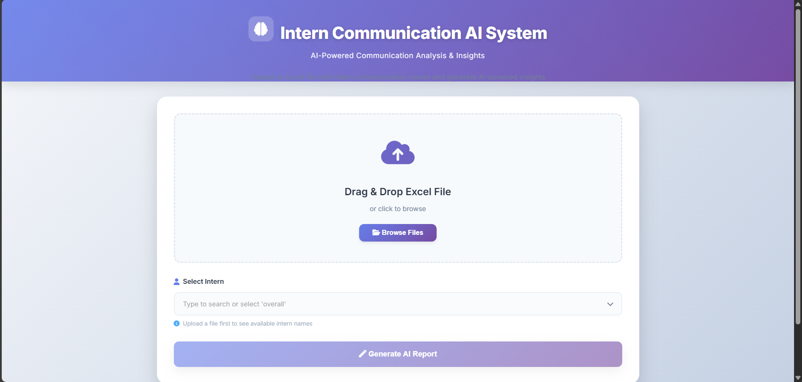
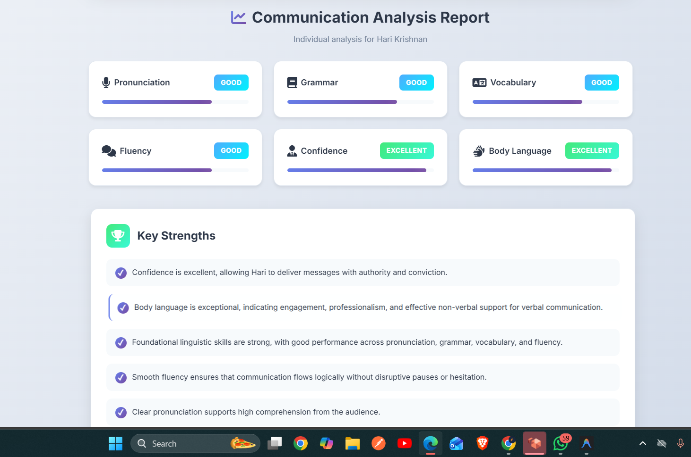
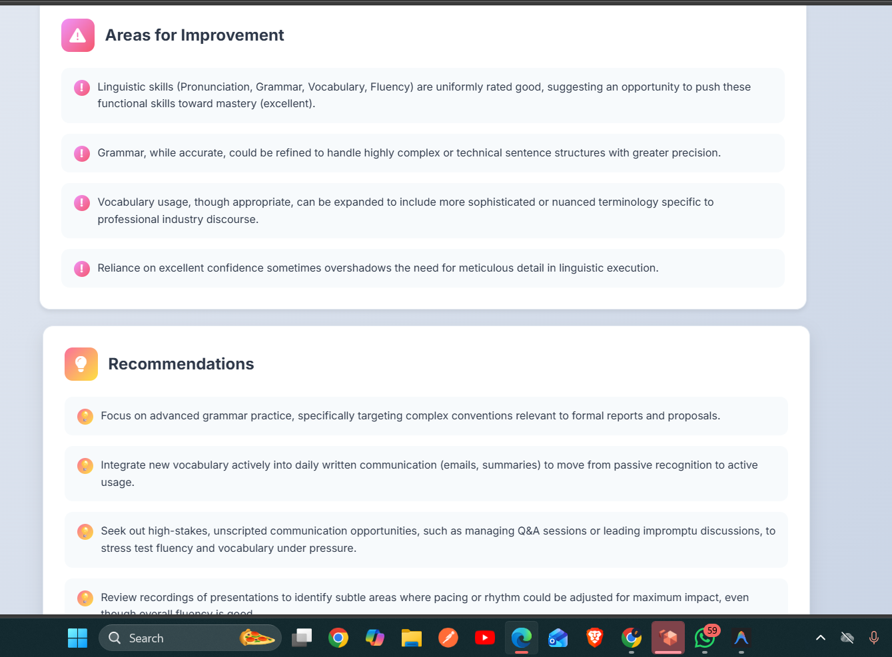
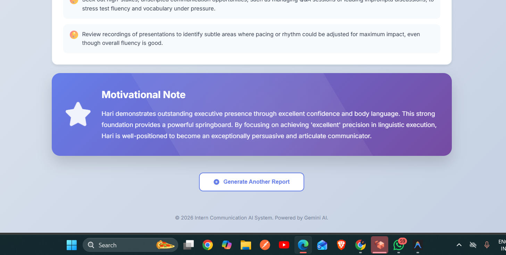

# Intern Communication AI System

An AI-powered tool designed to analyze and enhance intern communication skills based on evaluation scores. This system leverages the Gemini API to providing actionable feedback and personalized recommendations.

## features

- **Excel Upload**: Easily upload intern evaluation scores via Excel files.
- **Automated Analysis**: Calculates average scores for key communication metrics (Pronunciation, Grammar, Vocabulary, Fluency, Confidence, Body Language).
- **AI-Generated Insights**: Uses Google's Gemini API to generate detailed strengths, weaknesses, and improvement recommendations.
- **Personalized Reports**: Generates individual reports for specific interns or an overall summary for the entire cohort.
- **Interactive Dashboard**: User-friendly web interface for uploading files and viewing reports.

## Tech Stack

- **Backend**: Python, FastAPI
- **Frontend**: HTML5, CSS3, JavaScript
- **AI Integration**: Google Gemini API (`google-genai` library)
- **Data Processing**: Pandas

## Installation

1.  **Clone the repository**:
    ```bash
    git clone https://github.com/aharikrishnan0810/Communication-report.git
    cd Communication-report
    ```

2.  **Create a virtual environment**:
    ```bash
    python -m venv venv
    venv\Scripts\activate  # On Windows
    # source venv/bin/activate  # On macOS/Linux
    ```

3.  **Install dependencies**:
    ```bash
    pip install -r requirements.txt
    ```

4.  **Set up environment variables**:
    - Create a `.env` file in the root directory.
    - Add your Google Gemini API key:
      ```env
      GEMINI_API_KEY=your_api_key_here
      ```

## Usage

1.  **Start the server**:
    ```bash
    python app.py
    ```

2.  **Access the application**:
    Open your browser and navigate to `http://127.0.0.1:8000`.

3.  **Generate Reports**:
    - upload the provided sample Excel file (`sample_intern_scores.xlsx`) or your own data.
    - Select an intern's name from the dropdown or choose "Overall Report".
    - Click "Generate AI Report" to view insights.

## Screenshots

### Upload Interface


### Analysis Result


### Detailed Recommendations


### Motivational Notes


## Project Structure

```
├── app.py              # Main FastAPI application
├── debug_api.py        # script to test API connectivity
├── check_models.py     # Script to list available Gemini models
├── script.js           # Frontend logic
├── styles.css          # Frontend styling
├── index.html          # Main HTML file
├── data/               # Data storage
├── shots/              # Screenshots
├── .env                # Environment variables (not committed)
└── requirements.txt    # Python dependencies
```

## Contributing

Contributions are welcome! Please open an issue or submit a pull request for any improvements.

## License

This project is licensed under the MIT License.
