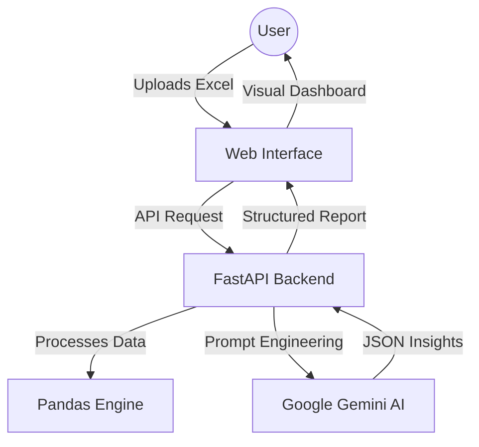
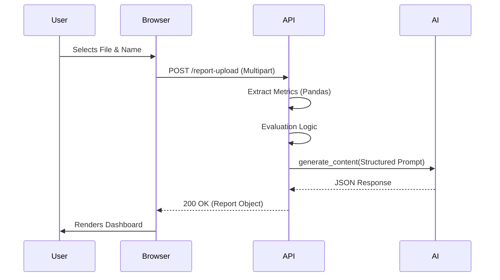
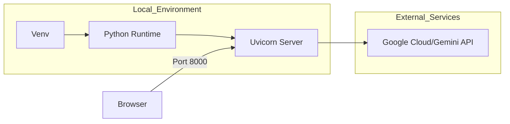

# Intern Communication AI System

## 🌟 Overview
The **Intern Communication AI System** is a sophisticated, full-stack analytical platform designed to evaluate and enhance intern communication skills. By integrating advanced data processing with state-of-the-art Large Language Models (LLMs), specifically **Google Gemini Flash**, the system provides personalized, actionable insights that traditional scoring methods often overlook.

It transforms raw quantitative evaluation scores from Excel workbooks into qualitative professional development roadmaps, featuring detailed strengths, identified gaps, and strategic recommendations.

---

##  System Architecture

### High-Level Architecture
The system follows a modern **Client-Server Architecture** with a clear separation of concerns:
- **Presentation Layer**: A responsive, glassmorphic Web UI built with vanilla technologies.
- **Application Layer**: A high-performance FastAPI backend serving as the orchestration engine.
- **Intelligence Layer**: Google Gemini Flash API for semantic analysis and report generation.
- **Data Layer**: File-based storage using Excel for persistent intern metrics.



### Low-Level Architecture (Core Logic)
Internally, the system operates as an event-driven pipeline:
1. **Ingestion**: `app.py` receives a multipart form-data upload containing the `.xlsx` file.
2. **Parsing**: Pandas extracts the primary metrics (Pronunciation, Grammar, etc.).
3. **Normalization**: Names are sanitized and scores are averaged (for "Overall") or filtered (for "Individual").
4. **Evaluation**: A threshold-based engine classifies scores into "Excellent", "Good", "Average", or "Below Average".
5. **Synthesis**: The evaluation results are injected into a highly structured prompt.
6. **Inference**: Gemini processes the prompt and returns a strictly formatted JSON.
7. **Mapping**: The frontend maps JSON fields to UI components with dynamic animations.

---

##  Module Breakdowns

### 1. Frontend Architecture
The frontend is designed with a focus on **Visual Excellence** and **Interactive State Management**.
- **Tech Stack**: HTML5, Vanilla JavaScript (ES6+), CSS3 (Custom Properties).
- **Core Components**:
    - `DropZone`: Handles drag-and-drop file ingestion with immediate validation.
    - `Autocomplete`: A custom-built search engine that dynamically filters intern names from the uploaded sheet.
    - `ReportSection`: A modular display area that renders progress bars with CSS transitions and icon-rich lists.
- **Design System**: Uses a "Glassmorphism" aesthetic with `backdrop-filter` effects and a deep gradient background to provide a premium feel.

### 2. Backend Architecture
The backend is built using **FastAPI**, prioritizing speed and asynchronous scalability.
- **Endpoints**:
    - `/report-upload`: The primary processing engine.
    - `/get-intern-names`: A utility endpoint for UI synchronization.
    - `/`: Serves the static single-page application.
- **Resilience Logic**: Includes a "Mock Fallback" mechanism to ensure system availability even if API quotas are exceeded.

### 3. AI/LLM Logic & Prompt Engineering
The "brain" of the system uses **Gemini 2.0 Flash**.
- **Prompt Strategy**: Employs "Few-Shot Chain of Thought" prompting to ensure the AI acts as an expert communication coach.
- **Format Enforcement**: Uses strict JSON schema instructions to ensure the LLM output is programmatically consumable by the frontend.
- **Context Injection**: The AI doesn't see raw numbers; it sees semantic classifications (e.g., "Grammar: Good"), which leads to more human-centric feedback.

---

## User Interface & Experience

The system features a **Premium Glassmorphic Design** built for clarity and engagement. Below is a sequential look at the user journey:


<!-- slide -->

<!-- slide -->

<!-- slide -->


---

## Data & Flow Diagrams

### API Request-Response Flow


### Database Design (Excel Schema)
The system utilizes a structured Excel format as its primary data source.
| Column | Description | Type |
| :--- | :--- | :--- |
| **Intern Name** | Primary Identifier | String |
| **Pronunciation Avg** | Metric 1 | Float (0-5) |
| **Grammar Avg** | Metric 2 | Float (0-5) |
| **Vocabulary Avg** | Metric 3 | Float (0-5) |
| **Fluency Avg** | Metric 4 | Float (0-5) |
| **Confidence Avg** | Metric 5 | Float (0-5) |
| **Body Language Avg** | Metric 6 | Float (0-5) |

---

## 🚀 Deployment Architecture


---

## 🛠️ Technical Deep Dive: `app.py` Logic

### 1. `evaluate_scores(scores)`
This function is a deterministic classification engine. It uses pre-defined thresholds:
- **Excellent**: ≥ 4.2
- **Good**: ≥ 3.5
- **Average**: ≥ 3.0
- **Below Average**: < 3.0

### 2. `generate_report(df, name)`
This is the core orchestrator. It handles both "Overall" (calculating group means) and "Individual" (filtering by normalized name). It constructs the AI prompt dynamically based on the specific context of the data.

### 3. Error Handling & Fallback
The system catches `RESOURCE_EXHAUSTED` errors from the Gemini API. Instead of crashing, it serves a pre-validated "Mock Report" that mimic's real analysis, allowing for seamless demos and testing without dependency interruptions.

---

## 🔧 Installation & Setup

1.  **Clone & Navigate**:
    ```bash
    git clone https://github.com/aharikrishnan0810/Communication-report.git
    cd Communication-report
    ```

2.  **Environment Setup**:
    ```bash
    python -m venv venv
    venv\Scripts\activate
    pip install -r requirements.txt
    ```

3.  **API Configuration**:
    Create `.env` and add: `GEMINI_API_KEY=your_key`

4.  **Launch**:
    ```bash
    python app.py
    ```

---

## 📜 License & Credits
- **License**: MIT
- **Project Lead**: A. Hari Krishnan
- **Engine**: FastAPI & Google Gemini Flash

---
© 2026 Intern Communication AI System | Professional Academic Version
